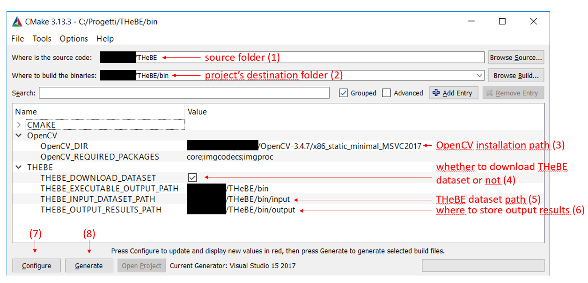

# THeBE: The THinning evaluation BEnchmark &nbsp;&nbsp;&nbsp; [](https://travis-ci.org/prittt/THeBE)
<!-- [](https://github.com/prittt/THeBE/releases/latest/) -->
[](https://github.com/prittt/THeBE/blob/master/LICENSE)

<table>
<thead>
<tr>
    <th>OS</th>
    <th>Build</th>
    <th>Compiler</th>
    <th>OpenCV</th>
    <th>CMake</th>
    <!--<th width="200px">Travis CI</th>-->
    <th width="200px">GitHub Actions</th>
</tr>
<thead>
<tbody>
<tr>
    <td align="center">Ubuntu<br/>16.04 LTS</td>
    <td align="center">x32</td>
    <td align="center">gcc 5.4.0</td>
    <td align="center">3.0.0</td>
    <td align="center">3.13.5</td>
    <td align="center"><a href="https://github.com/prittt/THeBE/actions"></a></td>
</tr>
<tr>
    <td align="center">Ubuntu<br/>18.04 LTS</td>
    <td align="center">x64</td>
    <td align="center">gcc 9.3.0</td>
    <td align="center">4.1.2</td>
    <td align="center">3.13.5</td><td align="center"><a href="https://github.com/prittt/THeBE/actions"></a></td>
</tr>
<tr>
    <td align="center">MacOS<br/>(Darwin 19.6.0)</td>
    <td align="center">x64</td>
    <td align="center">AppleClang 12.0.0<br/>(Xcode-12)</td>
    <td align="center">3.1.0</td>
    <td align="center">3.13.0</td>
    <td align="center"><a href="https://github.com/prittt/THeBE/actions"></a></td>
</tr>
</tbody>
</table>


<!--
<p align="justify">Please include the following reference when citing the THeBE project/dataset:</p>

- <p align="justify"> Bolelli, Federico; Grana, Costantino "Improving the Performance of Thinning Algorithms with Directed Rooted Acyclic Graphs" 20th International Conference on Image Analysis and Processing, 2019. <a title="BibTex" href="http://imagelab.ing.unimore.it/files2/thebe/THEBE_ICIAP2019_BibTex.html">BibTex</a>.</p>
-->

<p align="justify">
THeBE is an open source <i>C++</i> project that allows to compare thinning algorithms, highlighting strengths and weaknesses of different strategies available in literature.
</p>

## Requirements

<p align="justify">To correctly install and run THeBE following packages, libraries and utilities are needed:</p>

- CMake 3.0.0 or higher (https://cmake.org),
- OpenCV 3.0 or higher (http://opencv.org),
- Gnuplot (http://www.gnuplot.info/),
- One of your favourite IDE/compiler: Visual Studio 2013 or higher, Xcode 5.0.1, gcc 4.7 or higher, .. (with C++11 support)

Notes for gnuplot:
- on Windows system: be sure of adding gnuplot to the system path to allow the automatic charts generation.
- on MacOS system: 'pdf terminal' seems to be not available, 'postscript' is used instead.

<a name="inst"></a>
## Installation (refer to the image below)

- <p align="justify">Clone the GitHub repository (HTTPS clone URL: https://github.com/prittt/THeBE.git) or simply download the full master branch zip file and extract it (e.g THeBE folder).</p>
- <p align="justify">Install software in THeBE/bin subfolder (suggested) or wherever you want using CMake (point 2 of the example image). Note that CMake should automatically find the OpenCV path whether correctly installed on your OS (3), download the THeBE Dataset (be sure to check the box if you want to download it (4) or to select the correct path if the dataset is already on your file system (5)), and create a C++ project for the selected IDE/compiler (7-8).</p>



- <p align="justify">Set the <a href="#conf">configuration file (config.yaml)</a> placed in the installation folder (bin in this example) in order to select desired tests.</p>

- <p align="justify">Open the project, compile and run it: the work is done!</p>


<a name="conf"></a>
## Configuration File
<p align="justify">A <tt>YAML</tt> configuration file placed in the installation folder lets you to specify which kind of tests should be performed, on which datasets and on which algorithms. A complete description of all configuration parameters is reported below.</p>

- <i>perform</i> - dictionary which specifies the kind of tests to perform:
```yaml
perform:
  correctness:        false
  average:            true
  average_with_steps: false
```

- <i>correctness_tests</i> - dictionary indicating the kind of correctness tests to perform:
```yaml
correctness_tests:
  standard: true
  steps:    true
```

- <i>tests_number</i> - dictionary which sets the number of runs for each test available:
```yaml
tests_number:
  average:            10
  average_with_steps: 10
```

- <i>algorithms</i> - list of algorithms on which to apply the chosen tests, along with display name and reference for correctness check:
```yaml
algorithms:
  - ZhangSuenNoPtrs , ZS_OpenCV ; ZhangSuenNoPtrs
  - ZhangSuen       , ZS        ; ZhangSuenNoPtrs
  - ZhangSuenLUT    , ZS_LUT    ; ZhangSuenNoPtrs
  - ZhangSuenTree   , ZS_TREE   ; ZhangSuenNoPtrs
  - ZhangSuenDrag   , ZS_DRAG   ; ZhangSuenNoPtrs
  - GuoHall         , GH        ; GuoHall
  - GuoHallLUT      , GH_LUT    ; GuoHall
  - GuoHallTree     , GH_TREE   ; GuoHall
  - GuoHallDrag     , GH_DRAG   ; GuoHall
  - ChenHsu         , CH        ; ChenHsu
  - ChenHsuLUT      , CH_LUT    ; ChenHsu
  - ChenHsuTree     , CH_TREE   ; ChenHsu
  - ChenHsuDrag     , CH_DRAG   ; ChenHsu
```

- <i>check_datasets</i>, <i>average_datasets</i>, <i>average_datasets_with_steps</i> - lists of datasets on which, respectively, correctness, average, and average_with_steps tests should be run:
```yaml
...
average_datasets: ["fingerprints", "hamlet", "tobacco800", "xdocs"]
...
```

- <i>color_labels</i> - whether to save output images during tests:
```yaml
output_images: false
```

- <i>paths</i> - dictionary with both input (datasets) and output (results) paths. It is automatically filled by CMake during the creation of the project:
```yaml
paths: {input: "<datasets_path>", output: "<output_results_path>"}
```

- <i>save_middle_tests</i> - dictionary specifying, separately for every test, whether to save the output of single runs, or only a summary of the whole test:
```yaml
save_middle_tests: {average: false, average_with_steps: false}
```
